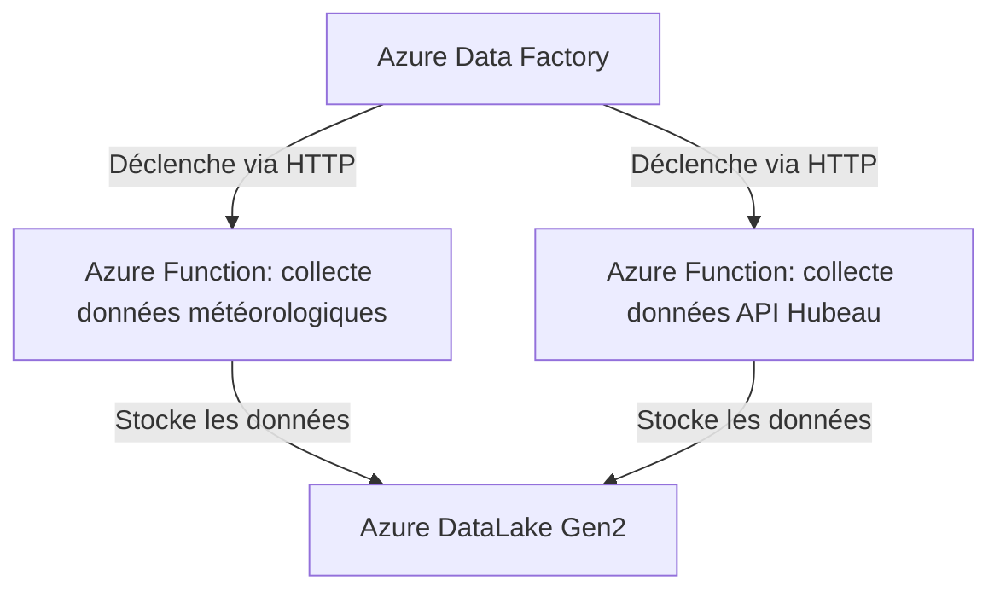

```mermaid
flowchart TD;
    A[Azure Data Factory] -->|Déclenche via HTTP| B["Azure Function: collecte données météorologiques"];
    A -->|Déclenche via HTTP| C["Azure Function: collecte données API Hubeau"];
    B -->|Stocke les données| D[Azure DataLake Gen2];
    C -->|Stocke les données| D;
```