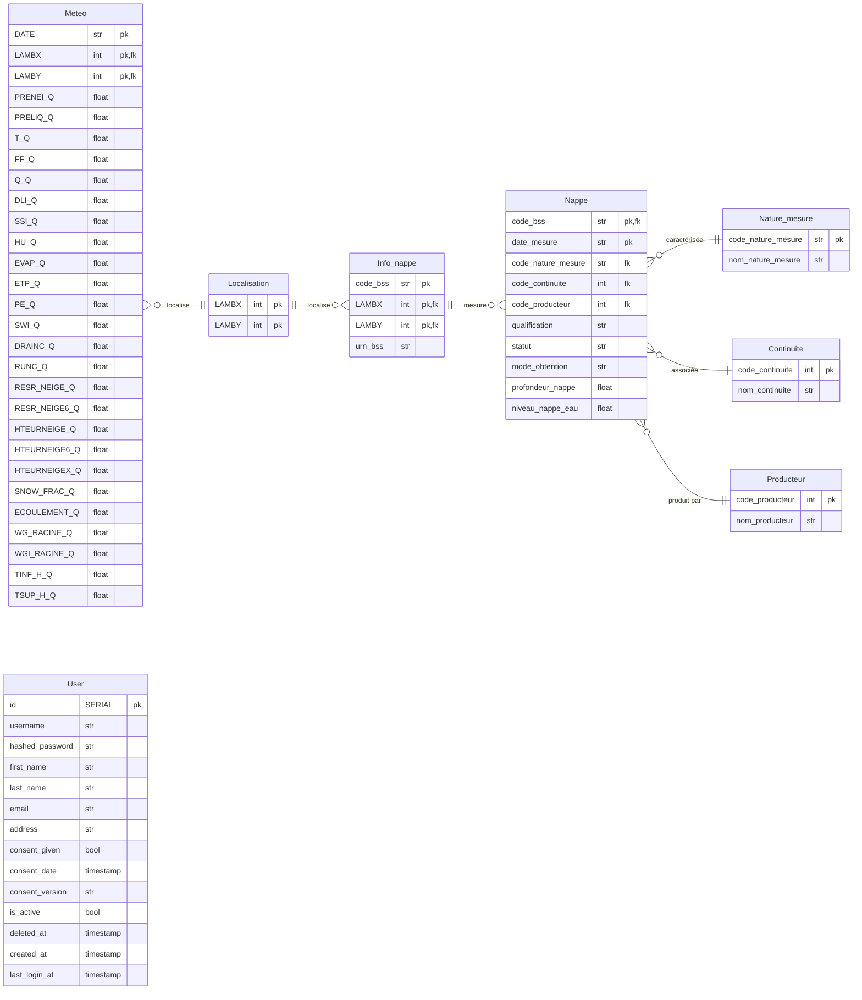

```mermaid
erDiagram
    direction LR

Meteo {
    DATE str pk
    LAMBX int pk,fk
    LAMBY int pk,fk
    PRENEI_Q float
    PRELIQ_Q float
    T_Q float
    FF_Q float
    Q_Q float
    DLI_Q float
    SSI_Q float
    HU_Q float
    EVAP_Q float
    ETP_Q float
    PE_Q float
    SWI_Q float
    DRAINC_Q float
    RUNC_Q float
    RESR_NEIGE_Q float
    RESR_NEIGE6_Q float
    HTEURNEIGE_Q float
    HTEURNEIGE6_Q float
    HTEURNEIGEX_Q float
    SNOW_FRAC_Q float
    ECOULEMENT_Q float
    WG_RACINE_Q float
    WGI_RACINE_Q float
    TINF_H_Q float
    TSUP_H_Q float
}
Info_nappe {
    code_bss str pk
    LAMBX int pk,fk
    LAMBY int pk,fk
    urn_bss str
}

Localisation {
    LAMBX int pk
    LAMBY int pk
}

Nappe {
    code_bss str pk,fk
    date_mesure str pk
    code_nature_mesure str fk
    code_continuite int fk
    code_producteur int fk 
    qualification str
    statut str
    mode_obtention str
    profondeur_nappe float
    niveau_nappe_eau float
}
Nature_mesure {
    code_nature_mesure str pk
    nom_nature_mesure str
}
Continuite {
    code_continuite int pk
    nom_continuite str
}
Producteur {
    code_producteur int pk
    nom_producteur str
}


User {
    id SERIAL pk

    username str 
    hashed_password str 

    first_name str
    last_name str
    email str
    address str

    consent_given bool 
    consent_date timestamp
    consent_version str

    is_active bool  
    deleted_at timestamp

    created_at timestamp 
    last_login_at timestamp
}


Meteo many to 1 Localisation : "localise"
Localisation 1 to many Info_nappe : "localise"
Info_nappe 1 to many Nappe : "mesure"
Nappe many to 1 Nature_mesure : "caractérisée "
Nappe many to 1 Continuite : "associée"
Nappe many to 1 Producteur : "produit par"

```
