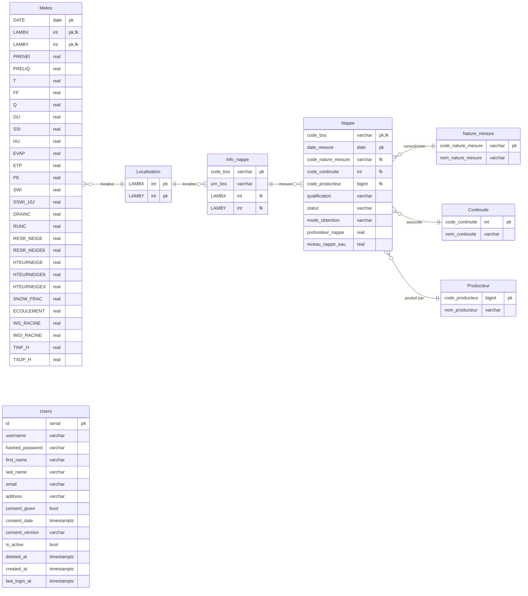

```mermaid
erDiagram
    direction LR

Localisation {
    LAMBX int pk
    LAMBY int pk
}

Meteo {
    DATE date pk
    LAMBX int pk,fk
    LAMBY int pk,fk
    PRENEI real
    PRELIQ real
    T real
    FF real
    Q real
    DLI real
    SSI real
    HU real
    EVAP real
    ETP real
    PE real
    SWI real
    SSWI_10J real
    DRAINC real
    RUNC real
    RESR_NEIGE real
    RESR_NEIGE6 real
    HTEURNEIGE real
    HTEURNEIGE6 real
    HTEURNEIGEX real
    SNOW_FRAC real
    ECOULEMENT real
    WG_RACINE real
    WGI_RACINE real
    TINF_H real
    TSUP_H real
}

Info_nappe {
    code_bss varchar pk
    urn_bss varchar
    LAMBX int fk
    LAMBY int fk
}

Nature_mesure {
    code_nature_mesure varchar pk
    nom_nature_mesure varchar
}

Continuite {
    code_continuite int pk
    nom_continuite varchar
}

Producteur {
    code_producteur bigint pk
    nom_producteur varchar
}

Nappe {
    code_bss varchar pk,fk
    date_mesure date pk
    code_nature_mesure varchar fk
    code_continuite int fk
    code_producteur bigint fk
    qualification varchar
    statut varchar
    mode_obtention varchar
    profondeur_nappe real
    niveau_nappe_eau real
}

Users {
    id serial pk
    username varchar
    hashed_password varchar
    first_name varchar
    last_name varchar
    email varchar
    address varchar
    consent_given bool
    consent_date timestamptz
    consent_version varchar
    is_active bool
    deleted_at timestamptz
    created_at timestamptz
    last_login_at timestamptz
}

Meteo many to 1 Localisation : "localise"
Localisation 1 to many Info_nappe : "localise"
Info_nappe 1 to many Nappe : "mesure"
Nappe many to 1 Nature_mesure : "caractérisée"
Nappe many to 1 Continuite : "associée"
Nappe many to 1 Producteur : "produit par"
```