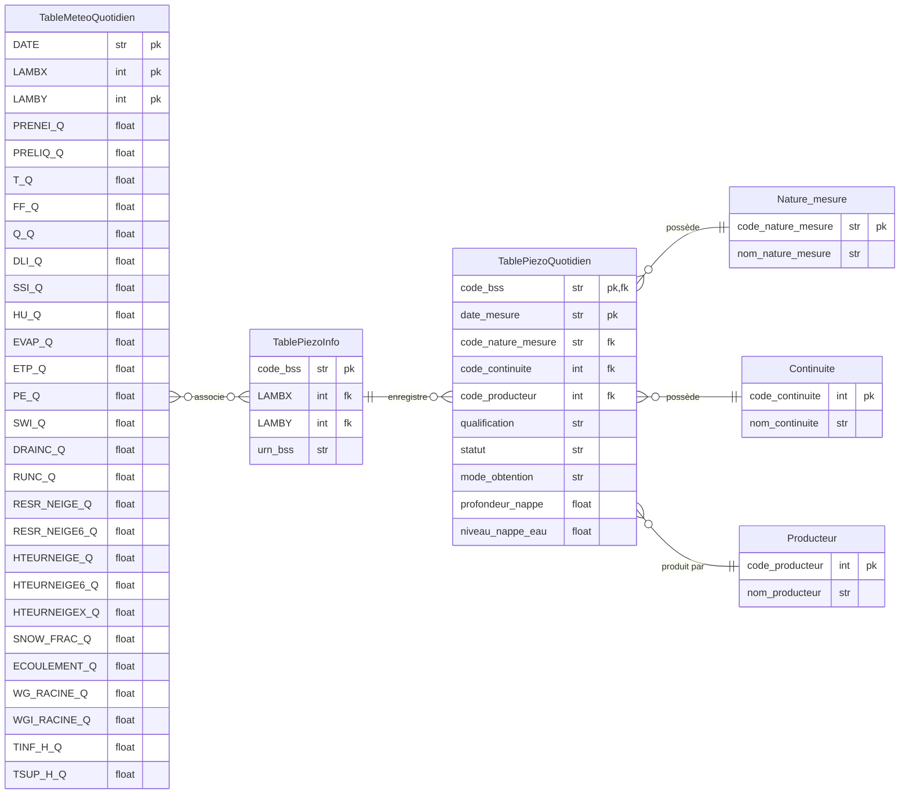

```mermaid
erDiagram
    direction LR
    
    TableMeteoQuotidien {
        DATE str pk
        LAMBX int pk
        LAMBY int pk
        PRENEI_Q float
        PRELIQ_Q float
        T_Q float
        FF_Q float
        Q_Q float
        DLI_Q float
        SSI_Q float
        HU_Q float
        EVAP_Q float
        ETP_Q float
        PE_Q float
        SWI_Q float
        DRAINC_Q float
        RUNC_Q float
        RESR_NEIGE_Q float
        RESR_NEIGE6_Q float
        HTEURNEIGE_Q float
        HTEURNEIGE6_Q float
        HTEURNEIGEX_Q float
        SNOW_FRAC_Q float
        ECOULEMENT_Q float
        WG_RACINE_Q float
        WGI_RACINE_Q float
        TINF_H_Q float
        TSUP_H_Q float
    }

    TablePiezoQuotidien {
        code_bss str pk,fk
        date_mesure str pk
        code_nature_mesure str fk
        code_continuite int fk
        code_producteur int fk 
        qualification str
        statut str
        mode_obtention str
        profondeur_nappe float
        niveau_nappe_eau float
    }
    Nature_mesure {
        code_nature_mesure str pk
        nom_nature_mesure str
    }
    Continuite {
        code_continuite int pk
        nom_continuite str
    }
    Producteur {
        code_producteur int pk
        nom_producteur str
    }

    TablePiezoInfo {
        code_bss str pk
        LAMBX int fk
        LAMBY int fk
        urn_bss str
    }

    TableMeteoQuotidien many to many TablePiezoInfo : "associe"
    TablePiezoInfo 1 to many TablePiezoQuotidien : "enregistre"
    TablePiezoQuotidien many to 1 Nature_mesure : "possède"
    TablePiezoQuotidien many to 1 Continuite : "possède"
    TablePiezoQuotidien many to 1 Producteur : "produit par"
```
